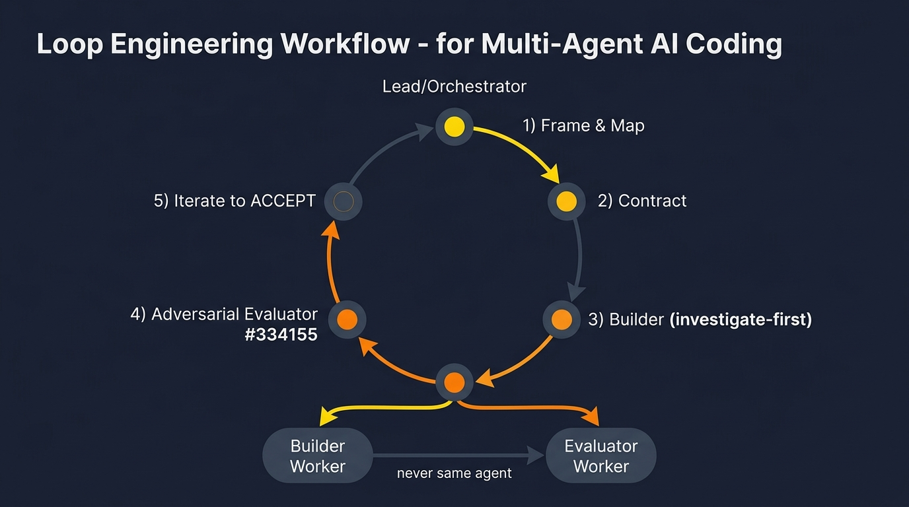

# Vibe-Loop Engineering with Google Antigravity — Multi-Agent Guide

> How to run the **loop-engineering workflow** (the same one that built Vibe-Auto-Cost across 3 submission rounds) using **Google Antigravity's** asynchronous subagents, Mission Control, and multi-agent teamwork.



---

## 0. What is Loop Engineering?

Loop engineering is a repeatable cycle for shipping verified software with AI agents — instead of a single linear "ask → code" chat, you run a **contract-driven loop** with separated, adversarial roles:

```
Frame → Discover → Contract → Builder (investigate-first) → Adversarial Evaluator → Iterate to ACCEPT
```

**The core principles (apply to every tool in this series):**
1. **Separation of roles** — a *Lead* frames and judges; a *Builder* writes code; an *Evaluator* tries to break it. Builder and Evaluator are **never the same agent**.
2. **Contract before code** — a written spec with measurable acceptance criteria (ACs).
3. **Adversarial, numeric verification** — "looks good" is rejected; every AC needs measurable evidence.
4. **Iterate to ACCEPT** — Round 1 often returns REJECT; fix BLOCKERs and re-run until ACCEPT.
5. **Guardrails** — schema validation, input bounds, deterministic fallbacks.

We used this to: clone a web UI to pixel parity (Phase 1, REJECT→ACCEPT in 2 rounds) and build a deterministic cost estimator with Pydantic guardrails (Phase 2, ACCEPT round 1).

---

## 1. Antigravity's Multi-Agent Primitives

Google Antigravity is an agent-first platform with an **Agent Manager ("Mission Control")** that delegates to subagents ([docs](https://antigravity.google/docs/subagents)):

| Primitive | What it is | Loop-engineering role |
|-----------|-----------|----------------------|
| **Parent agent (Mission Control)** | The main orchestrator; you talk to it directly | Lead — frames, judges, coordinates |
| **`invoke_subagent` tool** | Parent spawns a concurrent subagent with a role + prompt | Spawns Builder + Evaluator |
| **`define_subagent` tool** | Dynamically defines a custom subagent (prompt + toolset) | Define your Builder + Evaluator roles |
| **Async subagents** | Run in background; parent continues working | Builder + Evaluator run in parallel |
| **Inter-agent messaging** | Agents message each other by ID (not just parent↔child) | Evaluator reports back to Lead; Lead forwards fixes to Builder |
| **Git worktree isolation** | Subagent can inherit workspace OR use an isolated worktree | Keeps parallel Builder/Evaluator from clobbering files |
| **Built-in subagents** | `research` (codebase), `browser` (web), `self` (clone) | `research` = discovery helper; `browser` = visual eval |
| **`/teamwork-preview`** | Full multi-agent orchestration (Ultra plan) | Fully autonomous Lead-Builder-Evaluator loop |

**Key facts** ([docs](https://antigravity.google/docs/subagents)):
- Subagents start with a **clean context** (don't inherit parent's history) — perfect for the "never the same agent" rule.
- A parent can invoke **multiple subagents at once** → Builder + Evaluator in parallel.
- Subagents can invoke their own subagents (max nesting depth **10 levels**).
- Subagents inherit the parent's safety scopes (can't exceed approved permissions).
- Lifecycle states: **Running → Idle → Killed**. An idle agent can be re-awoken by a message and **retains its context**.

---

## 2. Prerequisites

1. **Google Antigravity** — install from [antigravity.google](https://antigravity.google) (Antigravity 2.0 or the Antigravity CLI).
2. A Google account with Antigravity access. For `/teamwork-preview` you need the **Ultra ($200/mo) plan**; the basic `invoke_subagent` / `define_subagent` flow works on lower tiers.
3. A project directory with git initialized (worktree isolation requires git).

```bash
# Start Antigravity in your project
antigravity
```

---

## 3. Step-by-Step: Set Up the Loop

### Step 1 — Write the contract (before any agents)

Create `docs/contract.md` in your project root. This is the source of truth all agents read:

```markdown
# Contract: [Feature Name]

## User Goal (verbatim)
> [exact user request — every fidelity word maps to a measurable criterion]

## Scope
- IN: [what to build]
- OUT: [what NOT to build]

## Acceptance Criteria (each measurable)
1. [Observable behavior + verification method]
2. [e.g. "CTA bg #0068D7 at rest, #0074F1 on hover — verify via getComputedStyle"]
3. ...

## Guardrails
- [e.g. "≤0 cost → 422", "score ∈ [0,100]", "deterministic fallback"]

## Validation commands
- `npm run build` → exit 0
- `pytest -q` → all pass
```

### Step 2 — Define the Builder + Evaluator subagents

In your main Antigravity session (the parent / Mission Control), use the `define_subagent` tool to create two custom subagents ([docs](https://antigravity.google/docs/custom-subagents-2)):

**Define the Builder:**
```
Use define_subagent to create a subagent named "builder" with:
- System prompt: "You are the BUILDER. Read the cited files and trace the call
  chain BEFORE writing code. Propose done-criteria + validation. After the lead
  accepts the plan, implement to spec — surgical edits only. Self-test aggressively
  (build, lint, test, fix, repeat). Do NOT self-evaluate against the acceptance
  criteria. Do NOT write an eval report. Report files changed + test results.
  Stop at 'compiles and passes tests.' Keep diffs minimal. Never revert files
  you didn't touch."
- Toolsets: read + write + terminal (bash) + subagent delegation.
```

**Define the Evaluator:**
```
Use define_subagent to create a subagent named "evaluator" with:
- System prompt: "You are the EVALUATOR. System belief: THIS CODE IS BROKEN —
  prove it. Read the contract + the builder's diff. For every acceptance criterion,
  run a programmatic, numeric check. 'Looks similar' is NOT evidence — use
  measurable thresholds (pixel-diff %, test pass/fail, computed-style equality,
  exact hex). An ACCEPT without numeric evidence is INVALID. Write a report:
  per-AC PASS/FAIL table, prioritized fix list (BLOCKER→NIT), verdict ACCEPT/REJECT.
  You and the builder are NEVER the same agent."
- Toolsets: read + terminal (read-only bash) + browser (for visual checks).
  NO write access — forces honest reporting.
```

> **Why no write access on the Evaluator?** An evaluator that can edit will "fix" instead of report. Antigravity's `define_subagent` lets you scope toolsets to read-only, write, or read+write+terminal — give the Evaluator read + terminal only.

### Step 3 — Run the loop (Parent = Lead)

**Turn 1 — Frame & discover:**
```
Read docs/contract.md. Invoke the "builder" subagent to investigate the
codebase and propose an implementation plan. Do NOT write code yet.
Use an isolated worktree for the builder.
```
The parent calls `invoke_subagent` → the builder runs asynchronously in a worktree, returns a plan. You can watch it in the **subagent panel** ([docs](https://antigravity.google/#invoking-subagents)).

**Turn 2 — Adversarial plan critique:**
```
Invoke the "evaluator" subagent to critique the builder's plan.
Find risks, missing edge cases, assumptions that could fail.
```
The evaluator (clean context, read-only) reviews the plan and reports risks.

**Turn 3 — Build:**
```
Plan accepted. Message the builder subagent: implement to the contract.
Self-test until build + tests pass. Report files changed.
```
Because Antigravity subagents retain context when re-awoken ([docs](https://antigravity.google/#2-idle)), the builder picks up where it left off — it remembers the plan it proposed.

**Turn 4 — Evaluate:**
```
Message the evaluator subagent: the builder reports done. Prove whether
it's correct. Run every AC as a numeric check. Write docs/eval_round_1.md
with verdict ACCEPT or REJECT.
```

**Turn 5 — Iterate (if REJECT):**
```
Message the builder: read docs/eval_round_1.md. Fix every BLOCKER.
Re-run self-tests.
```
Then re-evaluate → `eval_round_2.md`. Repeat until ACCEPT.

### Step 4 — Use worktree isolation for parallel work

When invoking subagents, choose **isolated Git worktree** so the Builder and Evaluator don't clobber each other's files ([docs](https://antigravity.google/#invoking-subagents)):
- Builder worktree: implements + tests in its own checkout.
- Evaluator: reads the builder's worktree (the parent has access to all subagent worktrees) and runs checks.
- On merge, the parent reconciles. Worktrees auto-clean up when a subagent is killed.

> ⚠️ Running multiple agents on the same repo requires **strict isolation and race-free communication** — Antigravity's worktree feature is built for this ([Medium: Orchestrating with Antigravity](https://medium.com/google-cloud/orchestrating-with-antigravity-a-crescendo-of-agents-part-2-ea39e3715506)).

### Step 5 — Monitor via the subagent panel

Watch each subagent's progress by clicking into its conversation in the **subagent panel** ([docs](https://antigravity.google/#subagent-lifecycle-and-states)). You can:
- **Stop** a running subagent (cancels generation → idle).
- **Message** an idle subagent to re-awaken it (it retains context).
- **Kill** a subagent permanently (cleans up its worktree).

### Step 6 — Use built-in subagents for discovery + visual eval

Antigravity ships with built-in subagents you can fold into the loop ([docs](https://antigravity.google/#built-in-subagents)):
- **`research`** — optimized for codebase research/navigation. Use it for the *discover* phase instead of (or alongside) the builder.
- **`browser`** — operates a sandboxed browser (invoked via `/browser`). Use it for *visual evaluation* — screenshot original vs. clone, compare computed styles. This is exactly what we did with Playwright in Vibe-Auto-Cost.
- **`self`** — a clone of the calling agent. Useful for parallelizing the *same* role (e.g. two builders on independent components).

---

## 4. The Full Loop in One Diagram

```
  ┌─────────────────────────────────────────┐
  │  LEAD (parent / Mission Control)         │
  │  Frame → write contract → judge diffs    │
  └──────────┬──────────────────┬───────────┘
             │ invoke_subagent   │ invoke_subagent
             │ (worktree)        │ (read-only)
     ┌───────▼───────┐  ┌──────▼──────────┐
     │  BUILDER       │  │  EVALUATOR       │
     │  custom subagent│  │  custom subagent │
     │  (read+write+   │  │  (read+browser,  │
     │   terminal)     │  │   NO write)      │
     │  investigate →  │  │  "code is BROKEN"│
     │  plan → build → │  │  numeric checks →│
     │  self-test      │  │  ACCEPT/REJECT   │
     └───────┬────────┘  └──────┬───────────┘
             │   ← inter-agent messaging →
             │                  │
     ┌───────▼──────────────────▼───────────┐
     │  ITERATE: REJECT → fix BLOCKERs →     │
     │  re-evaluate → ... → ACCEPT            │
     └───────────────────────────────────────┘
```

---

## 5. Concrete Example: UI Clone + Backend (What We Did)

**Phase 1 (UI clone to pixel parity):**
- Builder subagent (worktree-isolated): discovers design tokens via browser `getComputedStyle`, builds React components, self-tests with `npm run build`.
- Evaluator subagent (read-only + `browser`): opens original + clone in browser tabs, compares computed styles / bounding rects at 1440×900, writes `eval_round_1.md` (REJECT — 6 BLOCKERs: wrong tab count, gray CTA, missing semantic header, banner width, hover), then `eval_round_2.md` (ACCEPT after fixes).

**Phase 2 (backend + guardrails):**
- Builder subagent: builds FastAPI + Pydantic schema + guardrails, writes `test_engine.py`.
- Evaluator subagent: curls the API, verifies schema, checks guardrails (≤0→422, score∈[0,100], €150k cap), runs e2e browser test, writes `eval_round_1.md` (ACCEPT).

**Guardrails are part of the contract** — the Builder can't skip them:
```markdown
## Guardrails (in contract.md)
- Pydantic schema validation on every response; malformed → rejected
- ≤0 cost → HTTP 422
- score clamped to [0,100]
- >€150,000 → cap + flagged
- unknown input → fallback (never crash)
- deterministic: same input → identical output
```

---

## 6. Advanced: `/teamwork-preview` (Ultra Plan)

For fully autonomous orchestration, Antigravity 2.0's `/teamwork-preview` command launches a collaborative multi-agent framework with **built-in error recovery, automatic retries, and coordination logic** ([docs](https://antigravity.google/#multi-agent-teamwork-ultra-plan-only)):

```
/teamwork-preview
```
Then give the high-level goal:
```
Build [feature] per docs/contract.md. Spin up a builder and an adversarial
evaluator. Iterate until the evaluator returns ACCEPT. Apply all guardrails.
```
The platform manages the agent team — you just define the goal. This is the closest to "press button, get verified software."

> ⚠️ Ultra-plan exclusive. The manual `define_subagent` + `invoke_subagent` flow (Steps 2–5) works without it and gives you more control.

---

## 7. Checklist: Are You Doing It Right?

- [ ] Builder and Evaluator are **separate custom subagents** (via `define_subagent`) with different system prompts.
- [ ] Evaluator has **no write access** (read + terminal/browser only) and its prompt says "this is broken — prove it."
- [ ] A **contract.md** exists with measurable ACs *before* any code is written.
- [ ] Each round produces a written **eval_round_N.md** (REJECT/ACCEPT + numeric evidence).
- [ ] You **iterate** until ACCEPT — you don't accept the first build if the eval found BLOCKERs.
- [ ] **Guardrails** (schema, bounds, fallback) are in the contract and verified by the evaluator.
- [ ] Parallel subagents use **isolated Git worktrees** so they don't clobber each other's files.
- [ ] You (the parent/Lead) **judge diffs at design level** — you delegate, you don't write the code.
- [ ] Nesting depth stays reasonable (max 10 levels enforced; keep it ≤2–3 for sanity).

---

## 8. Sources & Further Reading

- [Antigravity: Asynchronous Subagents (official docs)](https://antigravity.google/docs/subagents) — lifecycle, invocation, messaging, limits.
- [Antigravity homepage](https://antigravity.google) — install + 2.0 / CLI.
- [One prompt, four subagents, ninety seconds (seroter.com)](https://seroter.com/2026/06/01/one-prompt-four-subagents-and-ninety-seconds-to-get-a-working-app/) — practical multi-subagent build.
- [Google Antigravity: Moving from "Solo Vibe" to "Squad" (Reddit r/vibecoding)](https://www.reddit.com/r/vibecoding/comments/1p3qzco/google_antigravity_moving_from_solo_vibe_to_squad/) — Agent Manager overview.
- [Orchestrating with Antigravity: A Crescendo of Agents (Medium)](https://medium.com/google-cloud/orchestrating-with-antigravity-a-crescendo-of-agents-part-2-ea39e3715506) — parallel agents + race-free communication.
- [Google Antigravity Multi Agent Workflow Speeds Up Builds (LinkedIn)](https://www.linkedin.com/pulse/google-antigravity-multi-agent-workflow-speeds-up-builds-goldie-gltcc) — workflow overview.
- [Antigravity sub agents (Google AI Developers Forum)](https://discuss.ai.google.dev/t/antigravity-sub-agents/114381) — community Q&A.

---

## 9. Quick-Start Commands

```bash
# 1. Install Antigravity from antigravity.google, then:
antigravity

# 2. Write the contract
mkdir -p docs
# → create docs/contract.md (see Step 1)

# 3. In the Antigravity session (Mission Control):

# Define the two subagents (Step 2):
# → "Use define_subagent to create 'builder' with prompt ... and read+write+terminal toolset."
# → "Use define_subagent to create 'evaluator' with prompt ... and read+browser toolset (NO write)."

# 4. Run the loop:
# → "Read docs/contract.md. Invoke 'builder' (worktree) to investigate + propose a plan. No code yet."
# → "Invoke 'evaluator' to critique the builder's plan."
# → "Message 'builder': plan accepted. Implement. Self-test until green."
# → "Message 'evaluator': builder's done. Prove it. Write docs/eval_round_1.md."
# → (if REJECT) "Message 'builder': fix the BLOCKERs from eval_round_1.md"
# → (repeat) "Message 'evaluator': re-evaluate. Write eval_round_2.md."
# → ACCEPT ✅

# 5. (Ultra plan) Fully autonomous:
# → /teamwork-preview
# → "Build [feature] per docs/contract.md with a builder + adversarial evaluator. Iterate to ACCEPT."
```

Happy vibe-looping. 🚗
